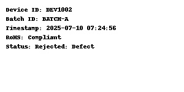
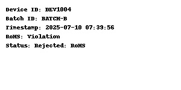
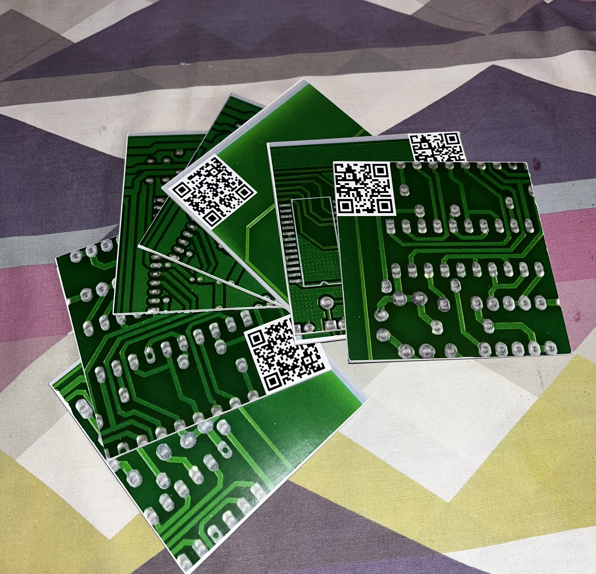
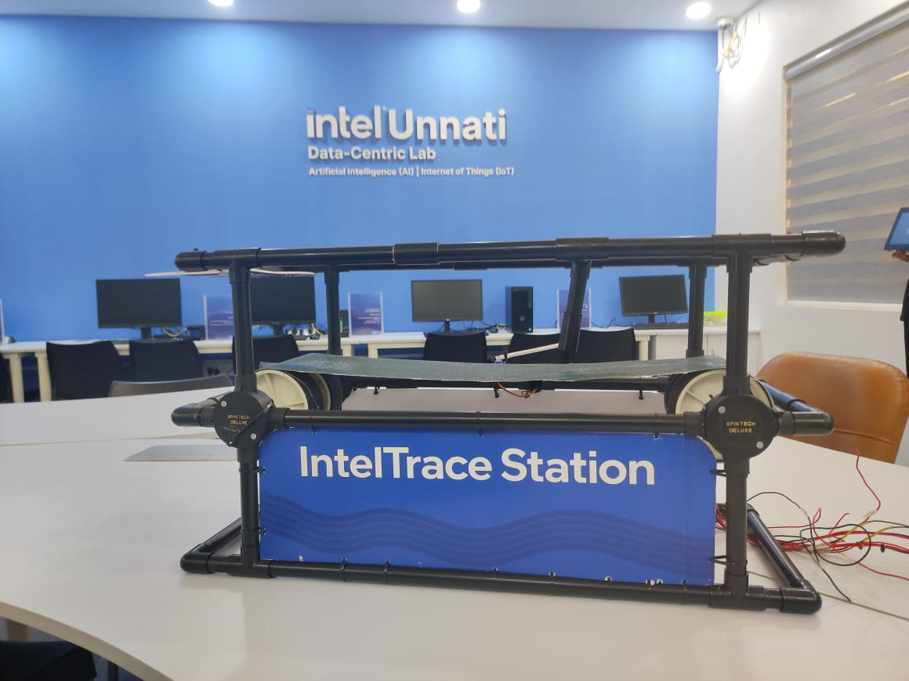

# Smart Product Labelling and Traceability System

An Intel Unnati Industry Training Project using Raspberry Pi 4, Computer Vision (YOLO), and real-time database logging to ensure RoHS compliance and detect PCB defects on a conveyor belt system.

---

## Features

- IR sensor detects product entry on conveyor  
- Camera captures PCB image upon detection  
- QR is read → Device ID & Batch ID extracted  
- RoHS compliance verified from local database (`rohs_compliance.csv`)  
- YOLOv8 model checks for cracks, holes, and burns on PCB  
- Non-compliant or defective PCBs are removed using servo motor  
- Conveyor belt is controlled via Raspberry Pi and motor driver  
- Final label (Device ID, Batch ID, RoHS Status, Result) is displayed on screen  
- All inspection records logged into `inspection_log.db`  

---

## Hardware Used

- Raspberry Pi 4  
- IR Sensor  
- USB Webcam  
- Motor Driver (L298N)  
- 2 DC Motors (Conveyor)  
- Servo Motor (for removal system)  

---

## Software Stack

- Python  
- OpenCV  
- YOLOv8 (Ultralytics)  
- pyzbar (for QR code reading)  
- SQLite3 / CSV for databases    

---

## 📁 Folder Structure

📁 code/ → main.py - single Python script

📁 models/ → YOLOv8 model for PCB defect detection

└── best.pt

📁 db/

├── rohs_compliance.csv - device/batch status

└── inspection_log.db - log of all inspections

📁 docs/

├── Final_database.pdf

├── Rohs_database.pdf

└── report.pdf

📁 images/

├── Complaint_defect_label.jpg

├── Rohs_violation_defect.jpg

├── Pcb.jpg

└── TraceStation.jpg

📁 videos/

└── Demo_video.mp4

---

## How It Works

1. IR sensor detects incoming product  
2. Camera captures image → QR is read  
3. Device ID & Batch ID checked in RoHS DB (`rohs_compliance.csv`)  
4. If not compliant → PCB is rejected using servo  
5. YOLO model checks for defects (cracks, holes, burn)  
6. If defective → PCB is also rejected  
7. Label with result is displayed on screen  
8. Inspection is logged into `inspection_log.db`  

---
### Databases

- [`rohs_compliance.db`](./database/rohs_compliance.db) – Stores known device IDs, batch IDs, and compliance info  
- [`inspection_log.db`](./database/inspection_log.db) – Stores inspection results (pass/fail, timestamps, image references, etc.)

---

### Model Info

- Trained on PCB defect images (crack, hole, burn) using YOLOv8  
- [`best.pt`](./models/best.pt) – Final trained YOLOv8 model weights

### Documents
- [Final Database PDF](./docs/Final%20database.pdf)  
- [RoHS Database PDF](./docs/Rohs_database.pdf)

## Sample Images

### Labels
 
 
### Pcb images
  
### Prototype
  

## Demo Video

👉 https://drive.google.com/file/d/1ZvCEKYGpbcOFqddEUBZn2hIgykIMfiTf/view?usp=sharing

---
### Code

- [`main.py`](./code/main.py)
  
---

### Team Members

- JEFFIN I PATRICK   
- GEORGE K JOHN 
- ABIJITH SS

---

### License

This project is licensed under the [MIT License](./LICENSE).
